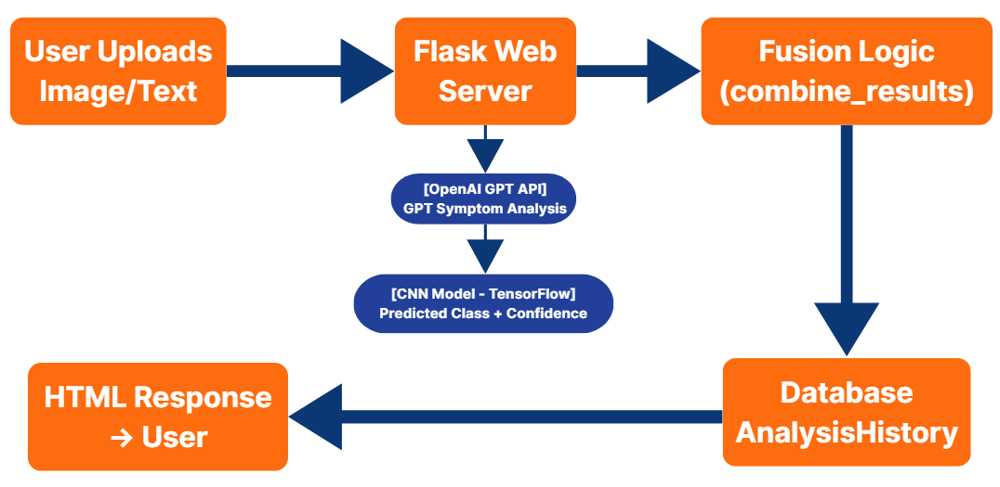

<h2 align="center">
    <a href="https://dainam.edu.vn/vi/khoa-cong-nghe-thong-tin">
    🎓 Faculty of Information Technology (DaiNam University)
    </a>
</h2>
<h2 align="center">
   HỆ THỐNG NHẬN DIỆN VÀ PHÂN LOẠI BỆNH DA LIỄU DỰA TRÊN HÌNH ẢNH Y KHOA
</h2>
<div align="center">
    <p align="center">
        
        
        
    </p>

[](https://www.facebook.com/DNUAIoTLab)
[](https://dainam.edu.vn/vi/khoa-cong-nghe-thong-tin)
[](https://dainam.edu.vn)
</div>

## 1. Giới thiệu

**Skin_Disease_AI** là một ứng dụng web sử dụng **trí tuệ nhân tạo** để hỗ trợ chẩn đoán các bệnh da liễu thường gặp. Hệ thống kết hợp **mô hình học sâu (CNN)** để phân tích hình ảnh và **mô hình ngôn ngữ (GPT)** để để phân tích mô tả triệu chứng và đưa ra **Kết luận y khoa ngắn gọn**. Toàn bộ hệ thống được xây dựng bằng Flask, có giao diện web thân thiện, chức năng kéo-thả ảnh, chatbot tư vấn, lưu lịch sử phân tích, và đăng nhập người dùng.
Người dùng có thể:
- 📸 Tải lên ảnh vùng da cần kiểm tra (hoặc kéo–thả trực tiếp).
- ✍️ Nhập mô tả triệu chứng đi kèm.
- 🤖 Nhận chẩn đoán tự động kèm gợi ý điều trị cơ bản.
- 💬 Trao đổi thêm với chatbot AI.
- 📊 Xem lại lịch sử các lần phân tích.

---

## ⚙️ 2. Công nghệ sử dụng

| Thành phần | Công nghệ - Mô tả |
|-------------|------------------|
| **Ngôn ngữ chính** | Python (Flask Framework) |
| **Frontend** | HTML5, CSS3, JavaScript , Responsive CSS |
| **Thư viện giao diện** | Dropzone.js (kéo & thả ảnh), Fetch API |
| **Backend** | Flask – xử lý logic, routing, API |
| **Cơ sở dữ liệu** | SQLite (local)  |
| **AI Model (Ảnh)** | TensorFlow + Keras (MobileNetV2 fine-tuned cho bệnh da liễu) |
| **AI Model (Ngôn ngữ)** | OpenAI GPT-4o-mini (phân tích mô tả & kết luận) |
| **Quản lý môi trường** | python-dotenv |
| **Xác thực người dùng** | Flask-Login, Flask-SQLAlchemy |
| **Môi trường phát triển** | PyCharm |

---

## 🧩 3. Kiến trúc hệ thống

### 🔹 3 lớp chính

1. **Frontend (Client)**  
   - Giao diện web: tải ảnh, nhập triệu chứng, xem kết quả.  
   - Chatbot giao tiếp trực tiếp với người dùng.
   - Lịch sử: Xem lịch sử phân tích được lưu trữ

2. **Backend (Flask Server)**  
   - Nhận yêu cầu từ client, xử lý logic.  
   - Gọi mô hình AI (CNN + GPT).  
   - Kết hợp kết quả và lưu vào cơ sở dữ liệu.  

3. **AI Layer**  
   - `MobileNetV2`: Phân loại bệnh da liễu từ ảnh.  
   - `GPT-4o-mini`: Phân tích mô tả triệu chứng.  
   - `Fusion Logic`: Kết hợp hai đầu ra và trả về kết luận cuối cùngcùng.

---

## 🔄 4. Luồng hoạt động

```text
Người dùng → Flask Server → AI Models (CNN + GPT) → Cơ sở dữ liệu → Giao diện kết quả
```

### 🌐 System Flow:
1. Người dùng tải ảnh & nhập mô tả triệu chứng.  
2. Flask lưu ảnh tạm và gọi mô hình AI.  
3. CNN dự đoán loại bệnh da liễu.  
4. GPT phân tích mô tả triệu chứng.  
5. Hai kết quả được kết hợp → trả kết luận.  
6. Kết quả lưu trong cơ sở dữ liệu `analysis_history`.  
7. Người dùng có thể xem lại hoặc hỏi chatbot.
### Sơ đồ hệ thống
- **Sơ đồ tổng quát**:
    <p align="center">
        
    </p>

---

## 💾 5️⃣ Cấu trúc cơ sở dữ liệu

### Bảng `users`
| Cột | Kiểu dữ liệu | Mô tả |
|------|---------------|--------|
| id | Integer | Khóa chính |
| username | String | Tên người dùng |
| email | String | Email đăng nhập |
| password_hash | String | Mật khẩu đã mã hóa |
| created_at | DateTime | Ngày tạo tài khoản |

### Bảng `analysis_history`
| Cột | Kiểu dữ liệu | Mô tả |
|------|---------------|--------|
| id | Integer | Khóa chính |
| user_id | Integer (FK) | Người thực hiện phân tích |
| image_path | String | Đường dẫn ảnh |
| cnn_result | String | Dự đoán từ CNN |
| confidence | Float | Mức tin cậy của CNN |
| gpt_result | Text | Phân tích của GPT |
| final_conclusion | Text | Kết luận kết hợp |
| created_at | DateTime | Thời gian phân tích |

---

## 🛠️ 6️⃣ Hướng dẫn cài đặt & chạy dự án

### 🔧 Yêu cầu hệ thống
- Python >= 3.9  
- pip >= 22  
- Virtual environment (khuyến nghị)  
- OpenAI API key hợp lệ  

### 📦 Bước cài đặt

```bash
# 1. Clone project
git clone https://github.com/<your-username>/ai-dermatology-diagnosis.git
cd ai-dermatology-diagnosis

# 2. Tạo môi trường ảo
python -m venv venv
source venv/bin/activate   # (Linux/Mac)
venv\Scripts\activate      # (Windows)

# 3. Cài đặt thư viện
pip install -r requirements.txt

# 4. Tạo file .env
touch .env
# Thêm vào:
OPENAI_API_KEY=your_api_key_here
FLASK_ENV=development

# 5. Chạy ứng dụng
python app.py
```

Ứng dụng sẽ chạy tại: **http://localhost:5000**

---

## 🌍 7️⃣ Triển khai (Deployment)

Dự án có thể triển khai dễ dàng trên:
- **Linux VPS / Cloud (AWS, GCP, Azure, Render)**  
- **Gunicorn + Nginx** cho production  
- **PostgreSQL** thay cho SQLite nếu cần mở rộng  

---

## 🚀 8️⃣ Hướng phát triển

✅ Cải thiện độ chính xác của mô hình AI  
✅ Thêm RESTful API cho mobile app  
✅ Tích hợp PWA để hoạt động offline  
✅ Thêm biểu đồ thống kê & phân tích xu hướng  
✅ Tăng tốc độ bằng Redis cache  
✅ Thêm AI Explainability (hiển thị vùng ảnh CNN tập trung)

## 5. Thông tin liên hệ

- **Họ tên**: Nguyễn Đức Duy  
- **Lớp**: CNTT 16-01  
- **Email**: [Nguyenducduy2612@icloud.com](mailto:Nguyenducduy2612@icloud.com)  
- **GitHub**: [github.com/nguyenducduy2612/Ung_Dung_Tra_Cuu_Tu_Dien_Anh_Viet](github.com/nguyenducduy2612/Ung_Dung_Tra_Cuu_Tu_Dien_Anh_Viet) 
- **Phòng thí nghiệm**: AIoTLab, Khoa Công Nghệ Thông Tin, Đại học Đại Nam  
- **Website**: [dainam.edu.vn](https://dainam.edu.vn)  
- **Facebook AIoTLab**: [facebook.com/DNUAIoTLab](https://www.facebook.com/DNUAIoTLab)

Nếu bạn có câu hỏi, gặp lỗi, hoặc muốn đề xuất tính năng mới (ví dụ: hỗ trợ tra cứu trực tuyến, thêm ngôn ngữ khác), hãy liên hệ qua email hoặc mở issue trên GitHub. Mọi đóng góp đều được hoan nghênh!

© 2025 AIoTLab, Khoa Công Nghệ Thông Tin, Đại học Đại Nam.
