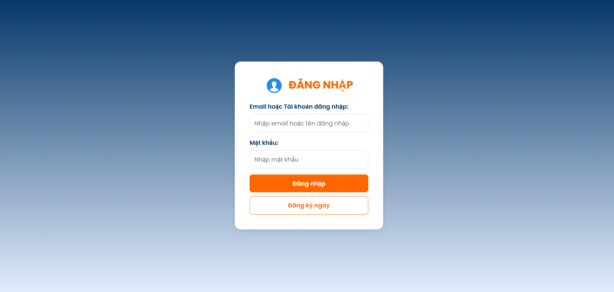
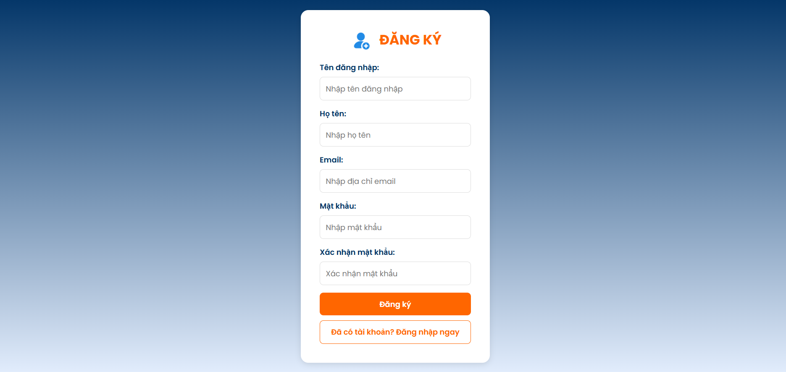
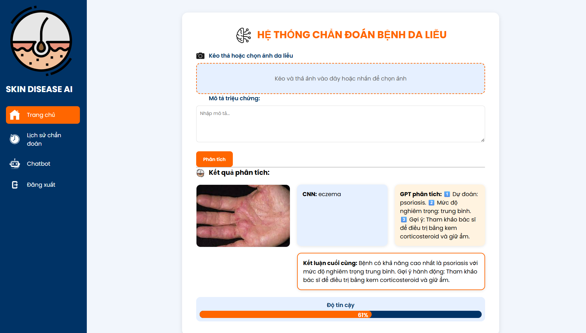
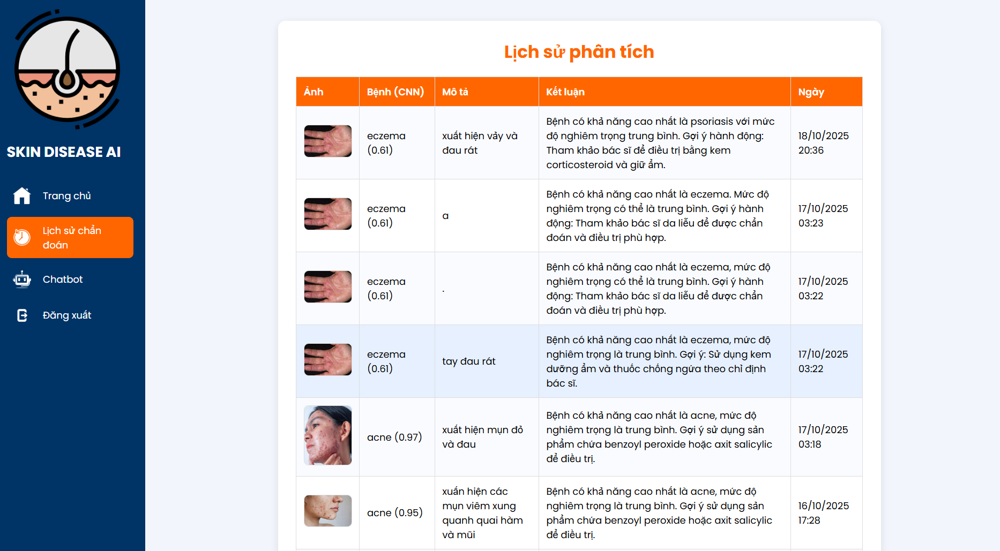
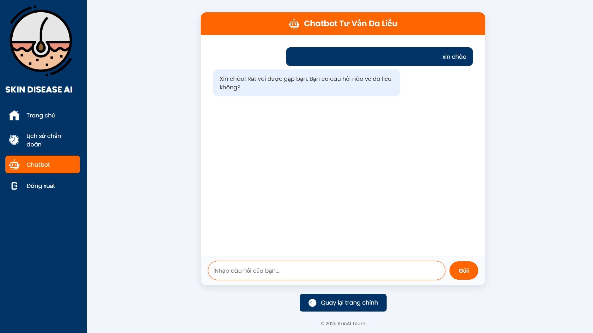
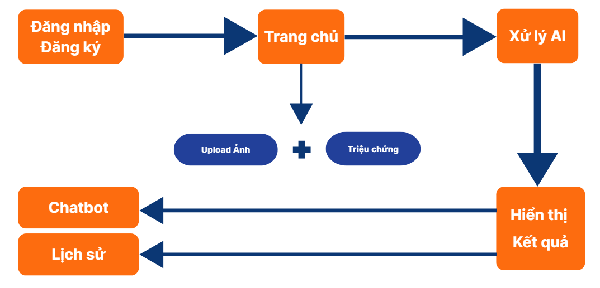

<h2 align="center">
    <a href="https://dainam.edu.vn/vi/khoa-cong-nghe-thong-tin">
    🎓 Faculty of Information Technology (DaiNam University)
    </a>
</h2>
<h2 align="center">
   HỆ THỐNG NHẬN DIỆN VÀ PHÂN LOẠI BỆNH DA LIỄU DỰA TRÊN HÌNH ẢNH Y KHOA
</h2>
<div align="center">
    <p align="center">
        
        
        
    </p>

[](https://www.facebook.com/DNUAIoTLab)
[](https://dainam.edu.vn/vi/khoa-cong-nghe-thong-tin)
[](https://dainam.edu.vn)
</div>

## 1. Giới thiệu

**Skin_Disease_AI** là một ứng dụng web sử dụng **trí tuệ nhân tạo** để hỗ trợ chẩn đoán các bệnh da liễu thường gặp. Hệ thống kết hợp **mô hình học sâu (CNN)** để phân tích hình ảnh và **mô hình ngôn ngữ (GPT)** để để phân tích mô tả triệu chứng và đưa ra **Kết luận y khoa ngắn gọn**. Toàn bộ hệ thống được xây dựng bằng Flask, có giao diện web thân thiện, chức năng kéo-thả ảnh, chatbot tư vấn, lưu lịch sử phân tích, và đăng nhập người dùng.
Người dùng có thể:
- 📸 Tải lên ảnh vùng da cần kiểm tra (hoặc kéo–thả trực tiếp).
- ✍️ Nhập mô tả triệu chứng đi kèm.
- 🤖 Nhận chẩn đoán tự động kèm gợi ý điều trị cơ bản.
- 💬 Trao đổi thêm với chatbot AI.
- 📊 Xem lại lịch sử các lần phân tích.

---

## ⚙️ 2. Công nghệ sử dụng

| Thành phần | Công nghệ - Mô tả |
|-------------|------------------|
| **Ngôn ngữ chính** | Python (Flask Framework) |
| **Frontend** | HTML5, CSS3, JavaScript , Responsive CSS |
| **Thư viện giao diện** | Dropzone.js (kéo & thả ảnh), Fetch API |
| **Backend** | Flask – xử lý logic, routing, API |
| **Cơ sở dữ liệu** | SQLite (local)  |
| **AI Model (Ảnh)** | TensorFlow + Keras (MobileNetV2 fine-tuned cho bệnh da liễu) |
| **AI Model (Ngôn ngữ)** | OpenAI GPT-4o-mini (phân tích mô tả & kết luận) |
| **Quản lý môi trường** | python-dotenv |
| **Xác thực người dùng** | Flask-Login, Flask-SQLAlchemy |
| **Môi trường phát triển** | PyCharm |

---

## 🧩 3. Kiến trúc hệ thống

### 🔹 3 lớp chính

1. **Frontend (Client)**  
   - Giao diện web: tải ảnh, nhập triệu chứng, xem kết quả.  
   - Chatbot giao tiếp trực tiếp với người dùng.
   - Lịch sử: Xem lịch sử phân tích được lưu trữ

2. **Backend (Flask Server)**  
   - Nhận yêu cầu từ client, xử lý logic.  
   - Gọi mô hình AI (CNN + GPT).  
   - Kết hợp kết quả và lưu vào cơ sở dữ liệu.  

3. **AI Layer**  
   - `MobileNetV2`: Phân loại bệnh da liễu từ ảnh.  
   - `GPT-4o-mini`: Phân tích mô tả triệu chứng.  
   - `Fusion Logic`: Kết hợp hai đầu ra và trả về kết luận cuối cùngcùng.

---
## 4. Hình ảnh giao diện

### Giao diện Hệ thống
- **Giao diện Đăng nhập**:
    <p align="center">
        
    </p>

- **Giao diện Đăng ký**:
    <p align="center">
        
    </p>

- **Giao diện Trang chủ**:
    <p align="center">
        
    </p>

- **Giao diện Lịch sử**:
    <p align="center">
        
    </p>
    
- **Giao diện Chatbot**:
    <p align="center">
        
    </p>
---
## 🔄 5. Luồng hoạt động

```text
Người dùng → Flask Server → AI Models (CNN + GPT) → Cơ sở dữ liệu → Giao diện kết quả
```

### 🌐 System Flow:
1. Người dùng tải ảnh & nhập mô tả triệu chứng.  
2. Flask lưu ảnh tạm và gọi mô hình AI.  
3. CNN dự đoán loại bệnh da liễu.  
4. GPT phân tích mô tả triệu chứng.  
5. Hai kết quả được kết hợp → trả kết luận.  
6. Kết quả lưu trong cơ sở dữ liệu `analysis_history`.  
7. Người dùng có thể xem lại hoặc hỏi chatbot.
### Sơ đồ hệ thống
- **Sơ đồ tổng quát**:
    <p align="center">
        
    </p>
- **Luồng hoạt động web app**:
    <p align="center">
        
    </p>
---

## 💾 6. Cấu trúc cơ sở dữ liệu

### Bảng `users`
| Cột | Kiểu dữ liệu | Mô tả |
|------|---------------|--------|
| id | Integer | Khóa chính |
| username | String | Tên người dùng |
| email | String | Email đăng nhập |
| password_hash | String | Mật khẩu đã mã hóa |

### Bảng `analysis_history`
| Cột | Kiểu dữ liệu | Mô tả |
|------|---------------|--------|
| id | Integer | Khóa chính |
| user_id | Integer (FK) | Người thực hiện phân tích |
| image_path | String | Đường dẫn ảnh |
| cnn_result | String | Dự đoán từ CNN |
| confidence | Float | Mức tin cậy của CNN |
| gpt_result | Text | Phân tích của GPT |
| final_conclusion | Text | Kết luận kết hợp |
| created_at | DateTime | Thời gian phân tích |

---

## 🛠️ 7. Hướng dẫn cài đặt & chạy dự án
### 📦 Hướng Dẫn Cài Đặt & Chạy Ứng Dụng — Skin Disease AI
#### ⚙️ Bước 1. Clone dự án về máy
Tải toàn bộ mã nguồn từ GitHub:
```bash
git clone https://github.com/nguyenducduy2612/Skin_Disease_AI.git
cd Skin_Disease_AI
```
#### 🧱 Bước 2. Tạo và kích hoạt môi trường ảo
Tạo môi trường ảo Python để tách biệt các thư viện:
```bash
python -m venv venv
```
Kích hoạt môi trường:
```bash
# Đối với Linux / macOS
source venv/bin/activate

# Đối với Windows (CMD)
venv\Scripts\activate
```
#### 📚 Bước 3. Cài đặt thư viện cần thiết
Cài đặt toàn bộ dependencies từ file `requirements.txt`:
```bash
pip install --upgrade pip
pip install -r requirements.txt
```
#### Bước 4. Cấu hình file .env
Tạo file `.env` trong thư mục gốc của dự án:
```bash
touch .env
```
Thêm nội dung sau (chỉnh sửa theo môi trường của bạn):
```bash
FLASK_ENV=development
OPENAI_API_KEY=your_openai_api_key_here
DATABASE_URL=sqlite:///instance/skin_ai.db
```
####  Bước 5. Chuẩn bị mô hình AI
Đảm bảo rằng 2 file mô hình đã sẵn sàng trong thư mục gốc:
```
mobilenetv2_best_model.h5
mobilenetv2_skin_finetuned.h5
```

Nếu chưa có, huấn luyện lại bằng lệnh:
```bash
python train.py
```
#### 🖥️ Bước 7. Chạy ứng dụng Flask
```bash
python app.py
# hoặc
flask --app app run
```
Ứng dụng chạy tại: [http://localhost:5000](http://localhost:5000)
#### 🧩 Thứ tự chạy các module chính

#### 1️⃣ app.py
Điểm khởi chạy chính của ứng dụng Flask.
- Khởi tạo server Flask
- Kết nối database
- Gọi các module: `fusion.py`, `chat.py`...
```bash
python app.py
```
#### 2️⃣ fusion.py
Kết hợp kết quả từ mô hình hình ảnh (CNN) và ngôn ngữ (GPT).
```bash
python fusion.py
```
#### 3️⃣ chat.py
Xử lý chatbot, giao tiếp với người dùng thông qua OpenAI GPT-4o-mini.
```bash
python chat.py
```
#### 4️⃣ evaluate.py
Đánh giá hiệu suất mô hình CNN (accuracy, precision, recall...)
```bash
python evaluate.py
```
✅ Sau khi khởi động thành công:
- 🩺 Tải ảnh da liễu và mô tả triệu chứng để phân tích.
- 💬 Dùng chatbot để hỏi thêm thông tin bệnh lý.
- 📊 Xem lại lịch sử chẩn đoán.
- 📁 Dữ liệu được lưu trong SQLite.
#### 🧱 Cấu trúc Thư Mục Dự Án — Skin Disease AI
#### 📁 Cấu trúc tổng thể
```bash
Skin_disease_ai/
│
├── .venv/ ← Môi trường ảo Python (virtual environment)
│
├── dataset/ ← Dữ liệu huấn luyện ban đầu (raw / train-test split)
├── dataset_final/ ← Dữ liệu huấn luyện cuối cùng sau tiền xử lý
├── instance/ ← Dữ liệu tạm, log hoặc file SQLite database
├── predict_images/ ← Ảnh người dùng tải lên để dự đoán
│
├── static/ ← File tĩnh (CSS, JS, ảnh giao diện)
├── templates/ ← Giao diện HTML (Flask render)
│
├── .env ← File cấu hình môi trường (API keys, DB URL,…)
│
├── app.py ← Điểm khởi chạy chính của ứng dụng Flask
├── chat.py ← Xử lý chatbot (gọi OpenAI GPT để trả lời người dùng)
├── evaluate.py ← Đánh giá mô hình CNN (accuracy, precision,…)
├── fusion.py ← Kết hợp kết quả từ CNN (hình ảnh) và GPT (mô tả)
│
├── mobilenetv2_best_model.h5 ← File mô hình CNN được huấn luyện tốt nhất
├── mobilenetv2_skin_finetuned.h5 ← Phiên bản mô hình fine-tuned cho bệnh da liễu
│
├── models.py ← Định nghĩa ORM (SQLAlchemy) cho User & AnalysisHistory
├── predict.py ← Hàm dự đoán bệnh từ ảnh (sử dụng mô hình CNN)
├── split_dataset.py ← Script chia tập dữ liệu train/test/validation
├── text_analysis.py ← Xử lý ngôn ngữ tự nhiên (gọi GPT-4o-mini)
├── train.py ← Mã huấn luyện mô hình CNN (MobileNetV2)
│
└── requirements.txt ← Danh sách thư viện cần cài đặt
```
---
### 🧩 Mô tả chi tiết các thành phần chính

| Thành phần | Vai trò chính |
|-------------|----------------|
| **app.py** | Ứng dụng Flask chính — định nghĩa routing, API endpoint, render template. |
| **fusion.py** | Kết hợp hai mô hình (CNN + GPT) để sinh ra kết luận cuối cùng. |
| **predict.py** | Nạp mô hình `.h5`, nhận ảnh và dự đoán loại bệnh da liễu. |
| **text_analysis.py** | Gửi mô tả triệu chứng người dùng đến GPT-4o-mini để phân tích. |
| **chat.py** | Module chatbot — giúp người dùng trao đổi thêm về bệnh hoặc kết quả dự đoán. |
| **models.py** | Cấu trúc cơ sở dữ liệu (Flask-SQLAlchemy): User, History,... |
| **train.py** | Huấn luyện mô hình MobileNetV2 từ dữ liệu da liễu. |
| **evaluate.py** | Đánh giá độ chính xác, precision, recall của mô hình. |
| **split_dataset.py** | Chia dữ liệu thành train/test/validation, đảm bảo cân bằng lớp. |
| **dataset/** & **dataset_final/** | Chứa ảnh da liễu theo nhãn bệnh, trước & sau tiền xử lý. |
| **predict_images/** | Thư mục lưu tạm ảnh người dùng tải lên để chẩn đoán. |
| **static/** | CSS, JS, hình ảnh giao diện web. |
| **templates/** | HTML templates (Flask dùng để render giao diện). |
| **.env** | File cấu hình môi trường (API Key,...). |
---

## 🚀 8. Hướng phát triển

✅ Cải thiện độ chính xác của mô hình AI  
✅ Thêm RESTful API cho mobile app  
✅ Tích hợp PWA để hoạt động offline  
✅ Thêm biểu đồ thống kê & phân tích xu hướng  
✅ Tăng tốc độ bằng Redis cache  
✅ Thêm AI Explainability (hiển thị vùng ảnh CNN tập trung)

##  👨‍💻 9. Thông tin liên hệ

- **Họ tên**: Nguyễn Đức Duy  
- **Lớp**: CNTT 16-01  
- **Email**: [Nguyenducduy2612@icloud.com](mailto:Nguyenducduy2612@icloud.com)  
- **GitHub**: [github.com/nguyenducduy2612/Ung_Dung_Tra_Cuu_Tu_Dien_Anh_Viet](github.com/nguyenducduy2612/Skin_Disease_AI) 
- **Phòng thí nghiệm**: AIoTLab, Khoa Công Nghệ Thông Tin, Đại học Đại Nam  
- **Website**: [dainam.edu.vn](https://dainam.edu.vn)  
- **Facebook AIoTLab**: [facebook.com/DNUAIoTLab](https://www.facebook.com/DNUAIoTLab)
> _"AI không thay thế bác sĩ, nhưng giúp bác sĩ và người bệnh hiểu rõ hơn về tình trạng da của mình."_ 🧴
